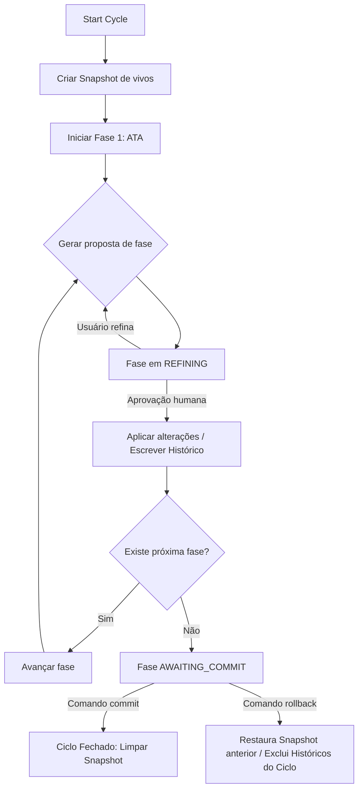

# Arquitetura e Estrutura de Camadas — MEDE-CLI

Este documento descreve a especificação arquitetural implementada no **MEDE-CLI**, descrevendo seus princípios fundamentais, organização de camadas, fluxo de execução e a verdade documental que rege o comportamento do sistema.

---

## 1. Princípios de Arquitetura

O MEDE-CLI adota uma arquitetura em **5 camadas bem definidas** com responsabilidades isoladas e desacopladas:

1. **Domain (Domínio)**
   Contém as regras de negócio puras da metodologia MEDE: entidades, enums, contratos de portas (interfaces) e políticas estruturais. O domínio não conhece banco de dados, sistemas de arquivos, rede ou bibliotecas de linha de comando.
2. **Application (Aplicação)**
   Orquestra os fluxos de casos de uso (como iniciar ciclo, refinar fase, aprovar, rejeitar, aplicar diff, rollback, commit). Ele delega a lógica de domínio para as entidades e a interação com o mundo externo para as interfaces de infraestrutura.
3. **Infrastructure (Infraestrutura)**
   Contém os adaptadores concretos e recursos técnicos: persistência SQLite via `better-sqlite3`, escrita e leitura física em arquivos Markdown, comunicação com provedores de LLM e geração/aplicação de diffs unificados.
4. **Interface/CLI (Apresentação)**
   Controla a interação com o usuário final. Inclui o parsing de comandos CLI (utilizando `commander`), o Console Interativo (REPL), a interface gráfica baseada em texto (TUI) desenvolvida em React/Ink e a formatação de retornos de sucesso/erro.
5. **Shared (Utilitários Compartilhados)**
   Contém códigos utilitários neutros, helpers transversais, criptografia, manipulação segura de caminhos de arquivos e suporte à internacionalização (i18n).

### Diretrizes de Desacoplamento
* **A CLI não decide regras metodológicas**: O mapeamento de fluxos, transições e avanços de fases está sob controle de serviços de aplicação.
* **O repositório não orquestra fluxos**: Ele é responsável apenas por persistir, atualizar e ler informações de banco ou disco.
* **A LLM não conhece o ciclo**: A IA atua apenas como geradora de propostas a partir do contexto documental e diretrizes que a aplicação lhe envia.
* **Estado efêmero em `.mede/`**: A fonte da verdade reside estritamente nos documentos Markdown no disco do usuário. Se o banco SQLite local for deletado, a CLI reconstrói o estado original lendo a base documental histórica.

---

## 2. Estrutura de Diretórios Implementada

A árvore física de arquivos reflete fielmente as 5 camadas arquiteturais:

```text
src/
  cli/                           # Camada de Interface / CLI
    commands/                    # Controladores finos de comando CLI (*-command.ts)
    container.ts                 # Contêiner de Injeção de Dependência (Composition Root)
    error-handler.ts             # Captura e formatação amigável de erros da CLI
    index.ts                     # Ponto de entrada executável do Node.js
    output.ts                    # Emissão de resultados em modo Texto ou JSON estruturado
    repl.ts / repl-session.ts    # Console interativo (REPL) e gerenciamento de estado
    runner.ts                    # Registro de opções e comandos do Commander
    tui.tsx                      # Interface Gráfica de Terminal (TUI) com React/Ink

  application/                   # Camada de Aplicação
    services/                    # Orquestradores e serviços de caso de uso
      backlog-replay-service.ts  # Revalidação causal de itens do backlog documental
      backlog-sync-service.ts    # Sincronização de alterações de itens e tags entre SQLite/Markdown
      changes-service.ts         # Manipulação fina de change-sets e trecho-diffs (chunks)
      config-service.ts          # Inicialização e aplicação de mede.config.json
      consistency-checker-service.ts # Análise estrutural e integridade entre documentos
      cycle-service.ts           # Orquestração do ciclo: início, fases, commit e rollback
      files-service.ts           # Listagem, leitura e diff de arquivos operacionais
      init-service.ts            # Inicialização de novos projetos de desenvolvimento
      llm-service.ts             # Serviços utilitários e autenticação (OAuth, API-Key)
      phase-conversation-service.ts # Gerenciador de diálogos, refinamentos e slugs de fase
      project-reconstruction-service.ts # Reconstrutor do estado SQLite a partir do Markdown
      status-service.ts          # Projeção do relatório de status e progresso do ciclo
      tui-view-model-service.ts  # Ponte de estado para a TUI React/Ink

  domain/                        # Camada de Domínio
    entities/                    # Modelagem física das entidades de domínio
      backlog-entity.ts          # Item lógico do backlog metodológico
      cycle-entity.ts            # Metadados e status global do ciclo ativo
      project-entity.ts          # Metadados do projeto alvo
      phase-entity.ts            # Controle individual da execução de fases do ciclo
      change-set-entity.ts       # Proposta agregadora de mudanças para arquivos vivos
      change-chunk-entity.ts     # Trecho de alteração individual (diff chunk)
      operational-event-entity.ts # Trilha de auditoria operacional do ciclo
      mede-config-model-entity.ts # Estrutura padrão de configuração mede.config.json
      ...
    enums/                       # Enumerados de domínio
      backlog-status.ts          # Estados permitidos para itens de backlog (Pendente, Concluído, etc.)
    interfaces/                  # Portas de comunicação interna (Contracts)
      repositories/              # Contratos de persistência (Backlog, Cycle, FileSystem, etc.)
      services/                  # Contratos de serviços internos consumidos pela CLI/REPL

  infrastructure/                # Camada de Infraestrutura
    db/                          # Inicialização do SQLite e controle transacional
      better-sqlite-connection-factory.ts # Conexão com better-sqlite3
      migrations.ts              # Migrações automáticas de tabelas SQLite
      unit-of-work.ts            # Padrão transacional compartilhado entre repositórios
    repositories/                # Adaptadores de dados concretos
      backlog-repository.ts      # Leitura e gravação SQLite do backlog
      cycle-repository.ts        # Persistência do ciclo e fases
      file-system-repository.ts  # Leitura/escrita física no disco e operações de snapshot
      project-repository.ts      # Persistência de projetos locais
      ...
    llm/                         # Integração e Adaptadores de Modelos de Linguagem
      providers/                 # Gateways de provedores (OpenAI, Anthropic, Gemini, Ollama, Azure)
      factory/                   # Instanciação dinâmica do provedor configurado
      llm-auth.ts                # Resolve fluxos de chaves, credenciais (ADC) e OAuth
      oauth-device-code-flow.ts  # OAuth Device Flow para Azure e Google
      openrouter-pkce-flow.ts    # OAuth PKCE com servidor de callback local para OpenRouter

  shared/                        # Camada Transversal Compartilhada
    diff.ts                      # Motor de geração, análise sintática e aplicação de diffs unificados
    i18n.ts                      # Suporte a traduções dinâmicas multilingues (pt-BR, en-US)
    current-state-parser.ts      # Analisador sintático de situcao-atual.md
    initial-understanding-parser.ts # Analisador sintático de entendimento-inicial.md
    crypto.ts                    # Encriptação e armazenamento de credenciais locais
    utils.ts                     # Auxiliares de strings, arrays e caminhos de arquivos
    json.ts                      # Utilitários para decodificação segura de JSONs gerados pela LLM
```

---

## 3. Fluxo de Execução do Ciclo Causual

O ciclo metodológico do MEDE-CLI flui através de transições lógicas controladas de forma sequencial na camada de aplicação:



### Regras metodológicas integradas nas fases:
1. **Rastreabilidade total**: O número do ciclo (total de atas registradas + 1) entra na convenção de nomenclatura de todos os artefatos históricos (`ata-YYYYMMDD-NNN.md`).
2. **Rejeição Crítica**:
   * A rejeição (`reject`) na fase **ATA** encerra o ciclo completo imediatamente por perda de causalidade geradora.
   * A rejeição nas demais fases apenas pula a fase correspondente (marca como `SKIPPED`/`REJECTED`) permitindo o prosseguimento lógico do restante do ciclo.

---

## 4. O Eixo de Domínio: Fase (PhaseExecution)

Diferente de sistemas comuns focados apenas em alterações agregadas de arquivos, o MEDE-CLI centra sua modelagem conceitual nas **Fases metodológicas**.

* Uma alteração de arquivo (`ChangeSet`) é tratada como um subproduto temporário que resulta da execução de uma fase.
* O contexto documental que a LLM consome é montado e injetado sob demanda em cada fase metodológica através da `PhaseDependencyPolicy`, garantindo que informações desconexas não poluam os tokens de envio.
* O estado é mantido em tabelas de controle de fases (`phases`), permitindo pausar e resumir ciclos de maneira segura.

---

## 5. Distribuição Comercial Segura

Para distribuição correta como pacote npm de código aberto, os seguintes arquivos/diretórios são empacotados através da especificação definida no `package.json` e documentada em [DISTRIBUICAO.md](./DISTRIBUICAO.md):
* **`dist/`**: Código binário TypeScript transpilado e empacotado em módulos ESM nativos pelo `tsdown`.
* **`locales/`**: Arquivos de internacionalização e templates de prompt baseados em HSL que o motor de aplicação lê em runtime.
* **`readme.md`, `CHANGELOG.md`, `LICENSE`**: Documentação complementar regulamentar.
