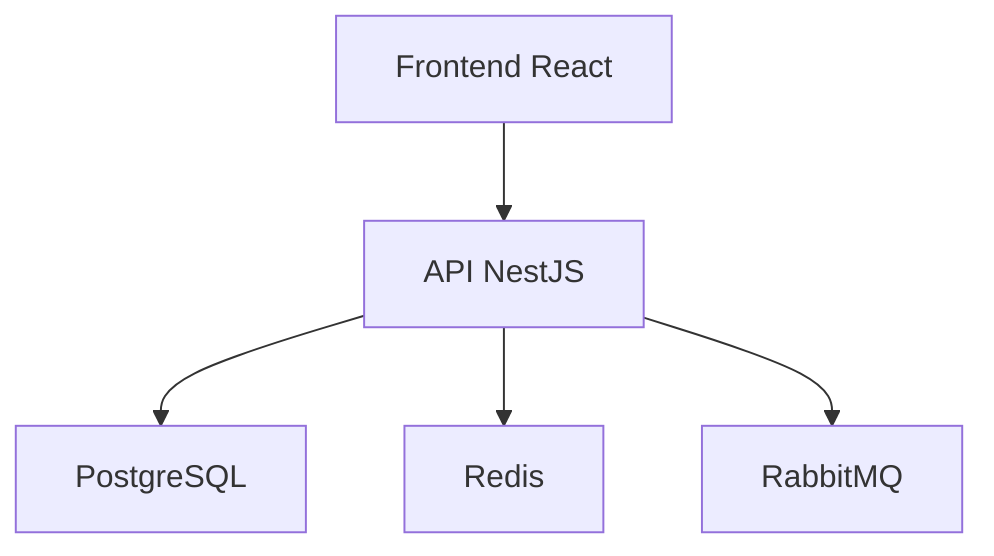

below is a readme template for you to use as a base
<README_TEMPLATE>
# README Template for Generation via LLM

You are a senior software architect and technical writer.

Your task is to generate a complete, professional, clear, and well-structured README.md for a software project.

The README must be written in valid Markdown.

Objective of the README:

* Allow fast onboarding of new developers
* Clearly explain the purpose, architecture, and execution of the project
* Document dependencies, configuration, deploy, and testing
* Be useful for both internal teams and open source

Use the following mandatory structure:

# Project Name

Brief objective description of the project in 2 to 4 lines.

## Overview

Explain:

* problem the project solves
* target audience
* main features
* differentiators
* business context, if applicable

## Features

List the main features in bullet points.

Example:

* User registration
* Login with JWT
* File upload
* Analytical dashboard
* Integration with external APIs

## Technologies Used

List:

* Languages
* Frameworks
* Databases
* Infrastructure tools
* Important libraries

Example:

* Node.js
* React
* NestJS
* PostgreSQL
* Docker
* Redis
* RabbitMQ

## Architecture

Explain:

* architectural pattern used
* division between frontend/backend
* external services
* databases
* messaging
* authentication
* observability

If it makes sense, include a Mermaid diagram.

Example:



## Directory Structure

Describe the main structure of the project.

Example:

```text
src/
├── modules/
├── shared/
├── infra/
├── config/
├── tests/
└── main.ts
```

Brief explain the responsibility of each folder.

## Prerequisites

List everything necessary to run the project locally.

Example:

* Node.js >= 20
* Docker >= 24
* PostgreSQL >= 15
* Redis
* Git

## Installation

Provide a detailed step-by-step for installation.

Example:

```bash
git clone <repository>
cd <project-name>
npm install
```

## Configuration

Explain:

* environment variables
* necessary files
* examples of `.env`

Example:

```env
PORT=3000
DATABASE_URL=
JWT_SECRET=
REDIS_HOST=
```

## Execution

Explain how to run:

* local environment
* development environment
* production environment
* docker compose, if it exists

Example:

```bash
npm run dev
npm run build
npm run start
```

## Available Scripts

List the most important scripts of the project.

Example:

```bash
npm run dev
npm run build
npm run lint
npm run test
npm run test:cov
```

## Tests

Explain:

* unit tests
* integration tests
* end-to-end tests
* coverage

Example:

```bash
npm run test
npm run test:integration
npm run test:e2e
npm run test:cov
```

## API / Endpoints

If it is a backend, document:

* Base URL
* authentication
* main endpoints
* Swagger/OpenAPI link

Example:

```text
GET /users
POST /auth/login
POST /contracts
```

## Database

Explain:

* database used
* migrations
* seed
* ORM
* how to create or update structure

Example:

```bash
npm run migration:run
npm run seed
```

## Deploy

Explain:

* deploy pipeline
* hosting environment
* CI/CD
* containers
* cloud provider
* rollback

## Observability

Explain:

* logs
* monitoring
* metrics
* tracing
* alerts

## Security

Explain:

* authentication
* authorization
* cryptography
* rate limiting
* protection against vulnerabilities

## Roadmap

List planned future improvements.

Example:

* Multi-tenant
* Internationalization
* Real-time dashboard
* AI integration

## Contributing

Explain:

* branch pattern
* commit convention
* pull requests
* code review

## License

Inform the license of the project.

</README_TEMPLATE>

Revise the project's README based on the context of this phase and propose an update in unified git diff format.

Priorities of this review:
1. keep the README consistent with the current state of the project;
2. improve clarity for those arriving at the project for the first time;
3. remove or correct vague, outdated, redundant, or inconsistent sections;
4. preserve correct already existing content whenever possible;
5. avoid duplication of content belonging to other documents.

When updating the README, evaluate mainly:
- objective description of the project;
- purpose and high-level scope;
- overview of operation or main flow;
- essential instructions for use, execution, or operation, when supported by context;
- main commands, if there is sufficient evidence;
- general organization and readability of the document.

Produza somente o unified git diff do README atual.
Se nenhuma alteração for necessária, responda exatamente:
NO_CHANGES
