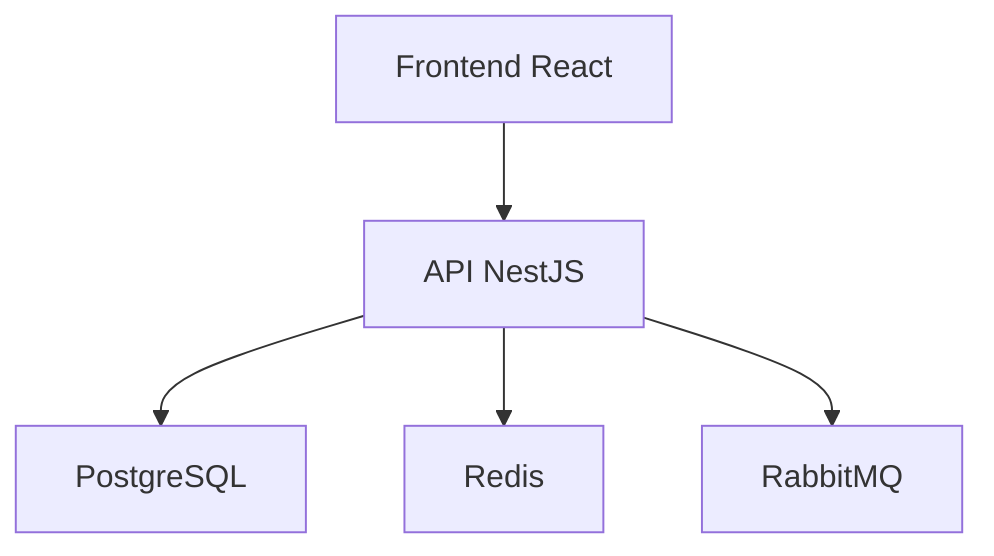

abaixo esta um modelo de readme, para voce usar como base
<MODELO_README>
# README Template para Geração via LLM

Você é um arquiteto de software sênior e redator técnico.

Sua tarefa é gerar um README.md completo, profissional, claro e bem estruturado para um projeto de software.

O README deve ser escrito em Markdown válido.

Objetivo do README:

* Permitir onboarding rápido de novos desenvolvedores
* Explicar claramente propósito, arquitetura e execução do projeto
* Documentar dependências, configuração, deploy e testes
* Ser útil tanto para times internos quanto para open source

Use a seguinte estrutura obrigatória:

# Nome do Projeto

Breve descrição objetiva do projeto em 2 a 4 linhas.

## Visão Geral

Explique:

* problema que o projeto resolve
* público-alvo
* principais funcionalidades
* diferenciais
* contexto de negócio, se aplicável

## Funcionalidades

Liste as principais funcionalidades em bullet points.

Exemplo:

* Cadastro de usuários
* Login com JWT
* Upload de arquivos
* Dashboard analítico
* Integração com APIs externas

## Tecnologias Utilizadas

Liste:

* Linguagens
* Frameworks
* Banco de dados
* Ferramentas de infraestrutura
* Bibliotecas importantes

Exemplo:

* Node.js
* React
* NestJS
* PostgreSQL
* Docker
* Redis
* RabbitMQ

## Arquitetura

Explique:

* padrão arquitetural utilizado
* divisão entre frontend/backend
* serviços externos
* banco de dados
* mensageria
* autenticação
* observabilidade

Se fizer sentido, inclua um diagrama Mermaid.

Exemplo:



## Estrutura de Pastas

Descreva a estrutura principal do projeto.

Exemplo:

```text
src/
├── modules/
├── shared/
├── infra/
├── config/
├── tests/
└── main.ts
```

Explique rapidamente a responsabilidade de cada pasta.

## Pré-requisitos

Liste tudo necessário para rodar o projeto localmente.

Exemplo:

* Node.js >= 20
* Docker >= 24
* PostgreSQL >= 15
* Redis
* Git

## Instalação

Forneça passo a passo detalhado para instalação.

Exemplo:

```bash
git clone <repositorio>
cd <nome-do-projeto>
npm install
```

## Configuração

Explique:

* variáveis de ambiente
* arquivos necessários
* exemplos de `.env`

Exemplo:

```env
PORT=3000
DATABASE_URL=
JWT_SECRET=
REDIS_HOST=
```

## Execução

Explique como rodar:

* ambiente local
* ambiente de desenvolvimento
* ambiente de produção
* docker compose, se existir

Exemplo:

```bash
npm run dev
npm run build
npm run start
```

## Scripts Disponíveis

Liste os scripts mais importantes do projeto.

Exemplo:

```bash
npm run dev
npm run build
npm run lint
npm run test
npm run test:cov
```

## Testes

Explique:

* testes unitários
* testes de integração
* testes end-to-end
* cobertura

Exemplo:

```bash
npm run test
npm run test:integration
npm run test:e2e
npm run test:cov
```

## API / Endpoints

Se for um backend, documente:

* URL base
* autenticação
* endpoints principais
* link do Swagger/OpenAPI

Exemplo:

```text
GET /users
POST /auth/login
POST /contracts
```

## Banco de Dados

Explique:

* banco utilizado
* migrations
* seed
* ORM
* como criar ou atualizar estrutura

Exemplo:

```bash
npm run migration:run
npm run seed
```

## Deploy

Explique:

* pipeline de deploy
* ambiente de hospedagem
* CI/CD
* containers
* cloud provider
* rollback

## Observabilidade

Explique:

* logs
* monitoramento
* métricas
* tracing
* alertas

## Segurança

Explique:

* autenticação
* autorização
* criptografia
* rate limiting
* proteção contra vulnerabilidades

## Roadmap

Liste melhorias futuras planejadas.

Exemplo:

* Multi-tenant
* Internacionalização
* Dashboard em tempo real
* Integração com IA

## Contribuição

Explique:

* padrão de branch
* convenção de commits
* pull requests
* revisão de código

## Licença

Informe a licença do projeto.

</MODELO_README>

Revise o README do projeto com base no contexto desta fase e proponha uma atualização em formato unified git diff.

Prioridades desta revisão:
1. manter o README consistente com o estado atual do projeto;
2. melhorar clareza para quem chega ao projeto pela primeira vez;
3. remover ou corrigir trechos vagos, desatualizados, redundantes ou inconsistentes;
4. preservar conteúdo correto já existente sempre que possível;
5. evitar duplicação de conteúdo que pertence a outros documentos.

Ao atualizar o README, avalie principalmente:
- descrição objetiva do projeto;
- propósito e escopo em alto nível;
- visão geral de funcionamento ou do fluxo principal;
- instruções essenciais de uso, execução ou operação, quando sustentadas pelo contexto;
- comandos principais, se existirem evidências suficientes;
- organização geral e legibilidade do documento.

Produza somente o unified git diff do README atual.
Se nenhuma alteração for necessária, responda exatamente:
NO_CHANGES
