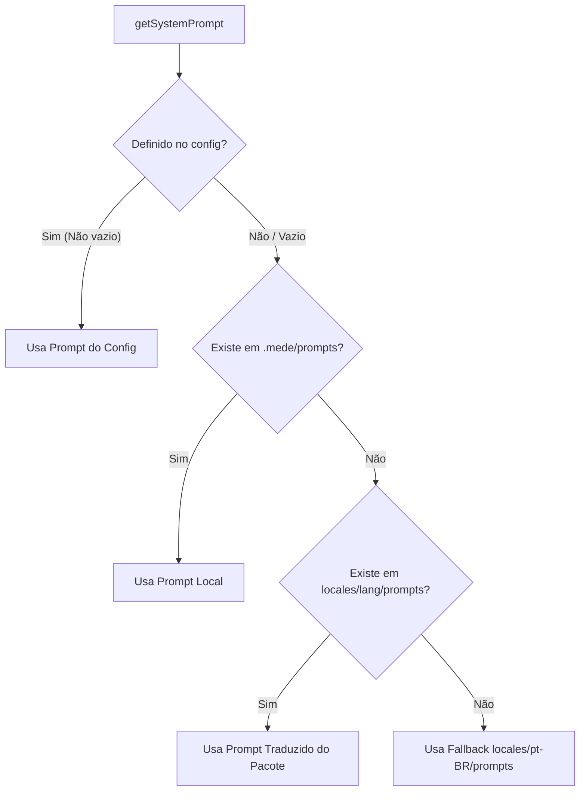

# Plano de Implementação de Testes Faltantes

Este documento apresenta o mapeamento dos testes unitários ausentes na arquitetura do **mede-cli** (com foco especial nas alterações recentes de internacionalização e resolução de prompts) e descreve o plano detalhado para implementá-los.

---

## 1. Mapeamento de Gaps de Testes

Atualmente, o projeto possui excelente cobertura de testes de integração e cenários E2E (com 262 testes no Vitest), porém existem lacunas em testes unitários isolados para serviços fundamentais da aplicação:

| Serviço | Módulo Testado | Cobertura Atual | Gap Identificado |
| :--- | :--- | :--- | :--- |
| **PhaseConversationService** | `phase-conversation-service.ts` | Indireta (E2E / LLM cycles) | Ausência de teste unitário para validar a hierarquia de 3 níveis de resolução de prompts. |
| **ConfigService** | `config-service.ts` | Indireta (E2E / CLI Handler) | Ausência de testes unitários para a geração de configuração padrão e fluxo de renomeação de arquivos (`apply`). |
| **InitService** | `init-service.ts` | Indireta (E2E) | Ausência de testes unitários testando inicialização isolada e criação de caminhos. |
| **StatusService** | `status-service.ts` | Indireta (E2E) | Ausência de testes unitários para a geração de relatórios de status em múltiplos idiomas. |

---

## 2. Detalhamento dos Novos Testes

### 2.1. Testes de Resolução de Prompts em 3 Níveis
**Arquivo**: [phase-conversation-service.test.ts](file:///D:/projetos/11Tech%20-%20Projetos/Engernharia%20de%20software/mede-cli/src/application/services/phase-conversation-service.test.ts)
* **Objetivo**: Garantir o funcionamento da cadeia de prioridade na resolução de prompts:
  1. **Prioridade 1 (`mede.config.json`)**: Definir prompt customizado na configuração e garantir que ele seja retornado prioritariamente.
  2. **Prioridade 2 (`.mede/prompts/`)**: Deixar o prompt vazio na configuração, criar o arquivo markdown correspondente em `.mede/prompts/` e validar que o conteúdo do arquivo local seja retornado.
  3. **Prioridade 3 (Pacote `locales/<lang>/prompts/`)**: Garantir fallback automático para os prompts padrão do pacote em múltiplos idiomas quando não houver sobrescrita local.
  

### 2.2. Testes Unitários de `ConfigService`
**Arquivo**: [config-service.test.ts](file:///D:/projetos/11Tech%20-%20Projetos/Engernharia%20de%20software/mede-cli/src/application/services/config-service.test.ts)
* **Objetivo**: Testar operações de configuração de forma isolada usando mocks do repositório de arquivos.
* **Cenários**:
  * `init()`: Validar que gera um arquivo `mede.config.json` válido contendo `"language": "pt-BR"` e sem o campo obsoleto `localesDir`.
  * `apply()`: Validar que renomeia arquivos e pastas de documentação caso o usuário mude os nomes ou o prefixo na configuração.
  * Normalização de Caminhos: Verificar que as rotinas de renomeação funcionam com barras unix (`/`) e barras windows (`\`).

### 2.3. Testes Unitários de `StatusService`
**Arquivo**: [status-service.test.ts](file:///D:/projetos/11Tech%20-%20Projetos/Engernharia%20de%20software/mede-cli/src/application/services/status-service.test.ts)
* **Objetivo**: Validar a geração correta de relatórios do terminal.
* **Cenários**:
  * Validar que as strings geradas no console respeitam as traduções dinâmicas carregadas com base no idioma configurado no projeto.

---

## 3. Cronograma de Execução

1. **Fase 1**: Criar [phase-conversation-service.test.ts](file:///D:/projetos/11Tech%20-%20Projetos/Engernharia%20de%20software/mede-cli/src/application/services/phase-conversation-service.test.ts) e implementar testes de prioridade de prompts.
2. **Fase 2**: Criar [config-service.test.ts](file:///D:/projetos/11Tech%20-%20Projetos/Engernharia%20de%20software/mede-cli/src/application/services/config-service.test.ts) e testar isoladamente as regras de renomeação e inicialização.
3. **Fase 3**: Criar [status-service.test.ts](file:///D:/projetos/11Tech%20-%20Projetos/Engernharia%20de%20software/mede-cli/src/application/services/status-service.test.ts).
4. **Fase 4**: Executar a suíte de testes e validação com linter.
